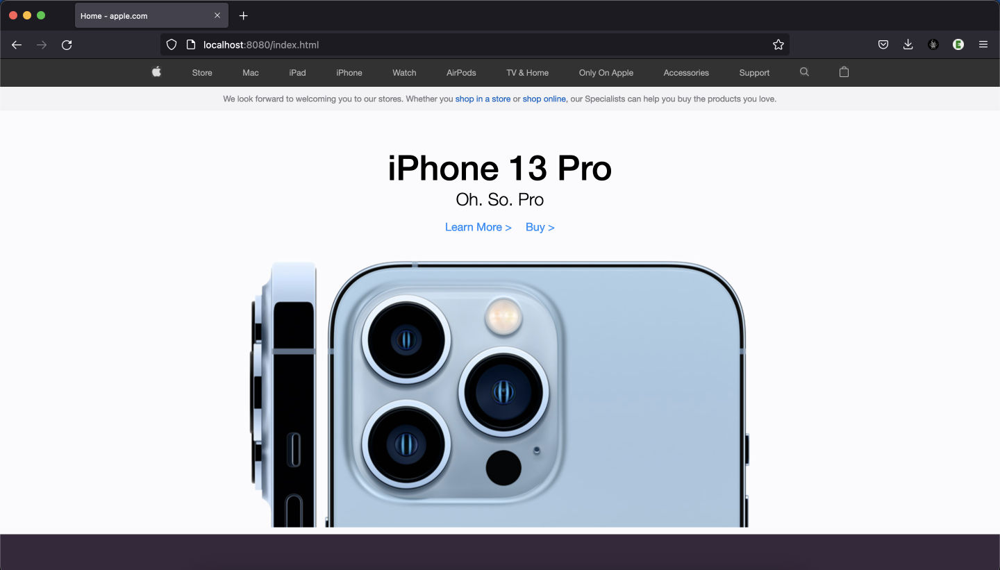

# Clone Apple Website


First, install local server:
```bash
cd html-css-website-apple

npm install
# or
yarn
```

and, run the development server:
```bash
npm run dev
# or
yarn dev
```

Access in your browser:
http://localhost:8080/

Check out our youtube video [Clone Apple Website](https://www.youtube.com/watch?v=TFVP6h1C7bk&t=1996s) for more details.


